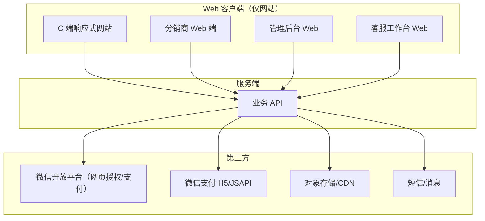
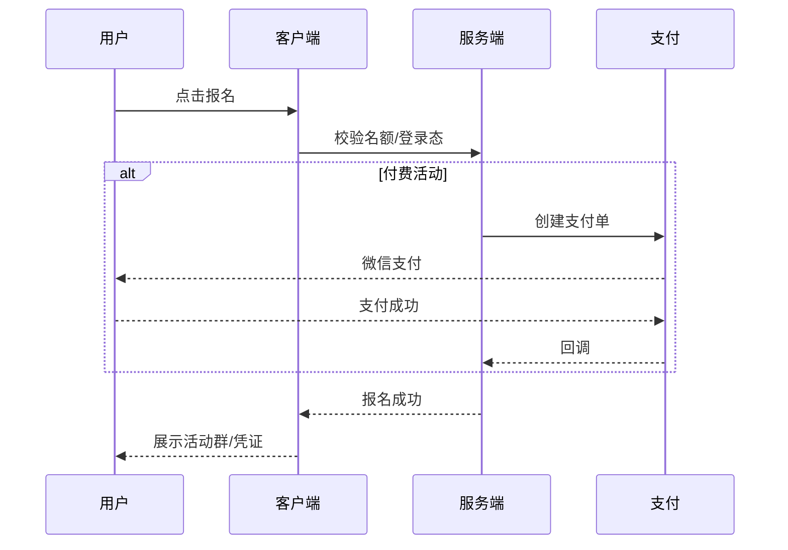
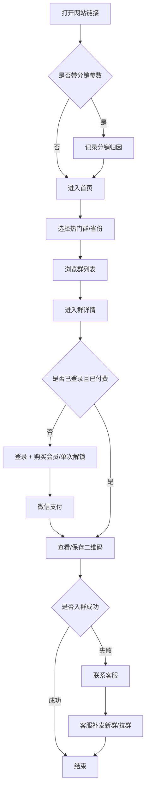
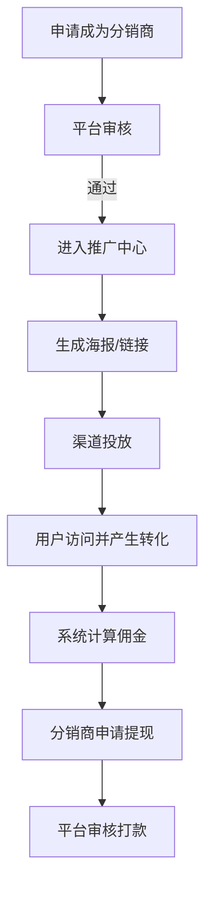

# 产品需求文档（PRD）

## 微信群搭子导流与分销平台

| 文档属性 | 内容 |
|---------|------|
| 产品名称 | 搭子式交友 · 微信群导流平台（暂定） |
| 文档版本 | v1.3 |
| 创建日期 | 2026-06-15 |
| 文档状态 | 已更新 |
| 交付形态 | **仅网站（响应式 Web / H5）**，不含微信小程序、不含原生 App |
| 参考站点 | [参考站点](https://ym.zh.s.ph.kk.chaosuliebian.cn/app/index.php?i=68&c=entry&eid=31) |

---

## 1. 文档说明

### 1.1 目的

本文档用于定义一款与参考站点同类的产品：**以「搭子式轻社交」为品牌定位，以「地区分类微信群导流」为核心能力，并叠加客服、线下游玩与分销商裂变的响应式网站（Web）**。

**交付边界：只做网站，不做微信小程序，不做 iOS/Android 原生客户端。** 用户通过浏览器访问（含微信内打开链接的场景），所有 C 端、分销商端、管理后台均为 Web 页面。

本文档面向产品、设计、研发、运营、商务等角色，作为需求对齐、排期评估与验收依据。

### 1.2 范围

| 范围 | 说明 |
|------|------|
| 包含 | C 端响应式网站、分销商 Web 端、平台管理后台 Web、客服能力、数据统计、支付与会员（如有） |
| 不包含 | **微信小程序**、**iOS/Android 原生 App**、微信客户端本体改造、非法导流/灰产能力、绕过微信平台规则的实现方案 |
| 假设 | 产品以网站形式在微信内外浏览器均可访问；群二维码由运营方合法持有并及时更新 |

### 1.3 术语

| 术语 | 定义 |
|------|------|
| 搭子 | 基于共同兴趣/场景的轻社交伙伴，强调「有事一起做」，非传统婚恋 |
| 导流 | 引导用户扫码加入微信群/联系客服/参与活动 |
| 分销商 | 通过推广链接/海报带来访问或付费转化的推广员 |
| 热门群 | 平台推荐的高曝光微信群集合 |
| 地区群 | 按省/市/区划分的本地化微信群 |
| 群卡片 | 展示群名称、封面、标签、人数、二维码/入群入口的单条内容单元 |

---

## 2. 背景与机会

### 2.1 市场背景

参考站点及同类产品呈现以下共性：

1. **轻社交需求上升**：年轻人更倾向「饭搭子、运动搭子、旅游搭子」等场景化社交，而非重关系链婚恋产品。
2. **微信群仍是重要私域载体**：活动报名、同城交流、兴趣圈子仍大量沉淀在微信群。
3. **地域化运营有效**：按省份/城市展示群列表，提升用户「同城感」与入群转化率。
4. **分销裂变是主要增长手段**：通过分销商推广链接、海报、佣金机制实现低成本获客。

参考站点首页可见能力包括：**热门群、全国省份 Tab、微信群列表、客服、线下游玩、分销商入口**，品牌 Slogan 为「搭子式交友 摆脱传统交友概念！（加群失败 联系客服）」。

### 2.2 产品机会

构建一个**可自营、可分销、可扩展**的微信群导流平台，相比直接购买 SaaS 模板，优势在于：

- 品牌与 UI 自主可控
- 分销规则、会员策略、地区运营策略可定制
- 后续可扩展线下活动、搭子匹配、会员付费等能力
- 数据沉淀在自己侧，便于精细化运营

### 2.3 竞品与差异化（建议）

| 维度 | 参考站点/同类 | 本产品建议差异化 |
|------|--------------|-----------------|
| 定位 | 微信群导流为主 | 导流 + 搭子场景标签 + 线下活动 |
| 地区 | 省级 Tab | 省/市/区三级 + LBS 默认定区 |
| 分销 | 基础分销商入口 | 一级 CPS 分销、素材库、实时佣金看板 |
| 转化 | 扫码入群 | 入群失败客服承接 + 加企微 + 活动报名 |
| 合规 | 依赖运营方 | 内置二维码失效监测、举报、内容审核 |

---

## 3. 产品定位

### 3.1 一句话定位

**帮助用户快速找到同城/同兴趣微信群与线下搭子活动的轻社交导流平台。**

### 3.2 产品价值主张

| 对象 | 价值 |
|------|------|
| C 端用户 | 按地区/兴趣快速找到可加入的微信群；加群失败有客服兜底；可发现线下游玩活动 |
| 分销商 | 低门槛推广，透明佣金与素材支持，可裂变获客 |
| 平台运营 | 统一管理群资源、地区策略、分销体系与转化漏斗 |
| 商家/活动方（二期） | 发布线下活动，获取精准本地流量 |

### 3.3 产品目标（12 个月）

| 目标类型 | 指标示例 |
|---------|---------|
| 增长 | 月活 UV 10 万+；分销商 1000+ |
| 转化 | 群卡片点击率 ≥ 15%；扫码后入群成功率 ≥ 60%（受群容量/风控影响） |
| 商业 | 会员/活动佣金/广告收入覆盖运营成本 |
| 体验 | 首页加载 ≤ 2s；客服首次响应 ≤ 5 分钟（工作时段） |

### 3.4 关键产品决策（已确认）

| 序号 | 决策项 | 结论 | 说明 |
|------|--------|------|------|
| 1 | 交付形态 | **仅网站** | 不做小程序、不做 App |
| 2 | 二维码访问 | **付费后可见** | 用户须登录并完成支付（开通会员或单次解锁）后，才可查看/保存群二维码 |
| 3 | 分销层级 | **一级分销** | 仅直接推广者获得佣金；不做二级及以上分销（合规优先，见 6.4.3） |
| 4 | 线下活动 | **自营为主 + 后期开放入驻** | MVP 平台自营活动；V1.1 开放合作方入驻（审核制），见 6.3 |
| 5 | 会员定价 | **三档订阅 + 可选单次解锁** | 月/季/年会员 + ¥9.9 单次解锁 1 群，见 6.6 |
| 6 | 端布局 | **响应式 Web，支持 PC 浏览器** | Mobile First 设计；主场景手机微信内打开；PC 通过 Chrome/Edge/Safari 等浏览器正常访问 |

---

## 4. 用户研究

### 4.1 目标用户画像

#### 画像 A：同城社交新手（核心 C 端）

- 年龄：18–35 岁
- 特征：想拓展圈子、怕社恐、希望「先线上群再线下见」
- 痛点：不知道去哪找靠谱同城群；扫码经常满员/失效
- 使用场景：打开链接 → 选省份 → 浏览热门群 → 扫码入群（手机）；或在 PC 浏览器打开 → 登录付费 → 查看/保存二维码

#### 画像 B：分销商/校园代理（增长端）

- 年龄：20–40 岁
- 特征：有私域流量、社群、短视频账号
- 痛点：缺乏标准化推广素材；佣金不透明
- 使用场景：注册分销商 → 生成推广海报 → 朋友圈/社群传播 → 查看佣金

#### 画像 C：平台运营

- 特征：负责群资源维护、地区配置、活动上架、风控
- 痛点：二维码失效难以及时感知；各地区转化差异大
- 使用场景：后台上传/批量更新群二维码 → 看数据 → 调整热门推荐

#### 画像 D：客服

- 特征：处理加群失败、咨询、投诉
- 使用场景：接收用户咨询 → 手动拉群/发新二维码/引导加企微

### 4.2 核心用户需求优先级

| 优先级 | 需求 | 说明 |
|--------|------|------|
| P0 | 按地区浏览微信群 | 与参考站点一致的核心能力 |
| P0 | 热门群推荐 | 提升转化与运营效率 |
| P0 | 扫码入群/展示二维码 | 核心闭环 |
| P0 | 加群失败联系客服 | 参考站点明确提示 |
| P1 | 分销商推广与佣金 | 参考站点有独立入口 |
| P1 | 线下游玩/活动 | 参考站点 Tab 能力 |
| P2 | 会员付费/解锁更多群 | 商业化 |
| P2 | 搭子匹配/组局 | 差异化扩展 |

---

## 5. 产品架构

### 5.1 系统组成



### 5.2 信息架构（C 端）

```text
首页
├── 顶部品牌区（Slogan / Banner）
├── 地区 Tab（热门群 + 全国省份）
├── 群列表（卡片流）
├── 底部导航
│   ├── 微信群（首页）
│   ├── 客服
│   ├── 线下游玩
│   └── 分销商
├── 群详情页
│   ├── 群介绍
│   ├── 标签（搭子类型/城市/人数）
│   ├── 入群二维码
│   └── 加群失败 → 联系客服
├── 客服页
│   ├── 在线客服入口
│   ├── 常见问题
│   └── 企微/个人微信二维码
├── 线下游玩页
│   ├── 活动列表
│   ├── 活动详情
│   └── 报名/咨询
└── 分销商页
    ├── 分销商介绍
    ├── 申请/登录
    └── 推广中心（登录后）
```

### 5.3 角色权限矩阵

| 功能 | 游客 | 登录未付费 | 付费会员 | 分销商 | 客服 | 运营 | 超管 |
|------|------|-----------|---------|--------|------|------|------|
| 浏览群列表 | ✅ | ✅ | ✅ | ✅ | ✅ | ✅ | ✅ |
| 查看群详情（名称/简介） | ✅ | ✅ | ✅ | ✅ | ✅ | ✅ | ✅ |
| 查看/保存群二维码 | ❌ | ❌ | ✅ | ✅ | ✅ | ✅ | ✅ |
| 联系客服 | ✅ | ✅ | ✅ | ✅ | ✅ | ✅ | ✅ |
| 报名线下活动 | ❌ | ✅ | ✅ | ✅ | ✅ | ✅ | ✅ |
| 分销推广 | ❌ | ❌ | ❌ | ✅ | ❌ | ✅ | ✅ |
| 群资源管理 | ❌ | ❌ | ❌ | ❌ | ❌ | ✅ | ✅ |
| 分销规则配置 | ❌ | ❌ | ❌ | ❌ | ❌ | ✅ | ✅ |
| 系统配置 | ❌ | ❌ | ❌ | ❌ | ❌ | ❌ | ✅ |

> **付费门槛**：二维码接口需服务端鉴权，未付费用户仅返回模糊占位图或「开通会员解锁」引导，禁止前端绕过。

---

## 6. 功能需求详述

### 6.1 首页 · 微信群模块（P0）

#### 6.1.1 页面结构

参考站点结构，首页包含：

1. **品牌 Slogan 区**
   - 文案示例：「搭子式交友 · 摆脱传统交友概念！」
   - 副提示：「加群失败请联系客服」
   - 支持后台配置 Banner 图、跳转链接

2. **地区 Tab 导航**
   - 第一个 Tab 固定为「热门群」
   - 后续 Tab 为全国省级行政区（可配置是否显示港澳台）
   - Tab 支持横向滑动
   - 默认选中策略：
     - 优先 IP/定位识别省份
     - 识别失败默认「热门群」

3. **群列表**
   - 支持下拉刷新、上拉分页
   - 列表为空时展示空态与客服引导

4. **底部导航（4 Tab）**
   - 微信群（当前页）
   - 客服
   - 线下游玩
   - 分销商

#### 6.1.2 群卡片字段

| 字段 | 必填 | 说明 |
|------|------|------|
| 群 ID | 是 | 系统唯一标识 |
| 群名称 | 是 | 如「北京饭搭子交流群」 |
| 封面图 | 否 | 默认图 + 自定义图 |
| 所属地区 | 是 | 省/市/区 |
| 搭子标签 | 否 | 饭搭子、旅游搭子、运动搭子等 |
| 群简介 | 否 | 50–200 字 |
| 当前人数 | 否 | 展示型，可手工/自动更新 |
| 群状态 | 是 | 正常/已满/已失效/隐藏 |
| 入群二维码 | 是 | 图片 URL，支持有效期 |
| 排序权重 | 是 | 用于热门推荐 |
| 是否热门 | 是 | 进入热门 Tab |
| 创建/更新时间 | 是 | 审计 |

#### 6.1.3 群详情页

**未付费状态（默认）：**

- 展示群名称、标签、地区、人数、简介
- 二维码区域显示模糊遮罩 + 文案「开通会员查看入群二维码」
- 主按钮：「立即开通」→ 跳转会员购买页
- 次按钮：「¥9.9 解锁本群」→ 单次购买当前群二维码（可选能力）
- 「加群失败？联系客服」（付费用户入群失败时使用）

**已付费状态：**

- 展示清晰入群二维码（大图）
- 操作按钮：
  - 「保存二维码」
  - 「复制群介绍」
  - 「加群失败？联系客服」
- 相关推荐：同地区 / 同标签群列表

**交互规则：**

1. 进入详情页须先登录（微信授权或手机号）
2. 服务端校验会员有效期或单次解锁记录后，才返回真实二维码 URL
3. 点击二维码可放大预览（仅付费用户）
4. 长按二维码保存（微信内置浏览器）；普通浏览器提供「保存图片」按钮
5. 每次展示真实二维码记一次「曝光」；保存/长按记「意向」
6. 若群状态 = 已满/失效：二维码置灰，展示「联系客服获取新群」（已付费用户不二次收费）

#### 6.1.4 热门群规则

| 规则项 | 说明 |
|--------|------|
| 入选条件 | 后台手动标记「热门」或自动按权重排序 |
| 排序因子 | 权重 > 近 7 日点击率 > 更新时间 |
| 数量上限 | 可配置，如 Top 50 |
| 失效处理 | 二维码失效自动下架或降权 |

#### 6.1.5 验收标准

- 切换省份 Tab 后 1 秒内展示对应列表（缓存命中场景）
- 群列表分页正常，无重复/漏项
- 失效群不会出现在热门前列
- 底部 4 个 Tab 跳转正确
- **未付费用户无法通过接口或前端手段获取真实二维码**
- **付费成功后即时解锁，无需刷新页面**

---

### 6.2 客服模块（P0）

#### 6.2.1 目标

承接「加群失败、二维码失效、咨询合作」等场景，降低用户流失。

#### 6.2.2 功能列表

| 功能 | 说明 |
|------|------|
| 在线客服入口 | 网页嵌入第三方在线客服（如美洽、智齿）或跳转企微客服链接 |
| 客服二维码 | 展示企微/个人微信二维码 |
| 常见问题 FAQ | 如「为什么扫码进不去？」「如何成为分销商？」 |
| 工单提交 | 用户填写微信号、问题类型、截图 |
| 会话记录 | 客服后台可查看用户咨询（若接入客服系统） |

#### 6.2.3 FAQ 默认条目（建议）

1. 扫码提示「群已满」怎么办？
2. 二维码过期了怎么办？
3. 开通会员后可以查看多少个群？
4. 单次解锁和会员有什么区别？
5. 如何成为分销商？
6. 如何发布线下活动？

#### 6.2.4 验收标准

- 首页 Slogan 与群详情页均可一键进入客服
- 提交工单后用户收到「已收到，将尽快处理」反馈
- 客服端可检索工单并标记处理状态

---

### 6.3 线下游玩模块（P1）

#### 6.3.1 目标与运营模式

从「入群」延伸到「线下活动转化」，提高用户粘性与商业化空间。

**运营模式（已确认）：自营为主 + 后期开放入驻**

| 阶段 | 模式 | 说明 |
|------|------|------|
| MVP / V1.0 | **平台自营** | 活动由运营团队创建、审核、履约；保证内容质量与品牌信任 |
| V1.1+ | **开放入驻（审核制）** | 合作方/达人申请入驻，平台审核后发布活动；平台抽佣 |

**建议理由：**

- 冷启动阶段自营可控，避免劣质活动伤害口碑
- 群资源与活动主题可联动（如「徒步搭子群 + 周末徒步活动」）
- 开放入驻前需建立审核 SOP、保证金/退款规则，再逐步放量

#### 6.3.2 合作方入驻（V1.1，预留）

| 能力 | 说明 |
|------|------|
| 入驻申请 | 主体信息、资质、历史活动案例 |
| 平台审核 | 运营人工审核，通过后可发活动 |
| 活动抽佣 | 平台收取报名金额 10%–20%（可配置） |
| 结算 | T+7，与退款规则联动 |
| 违规处理 | 下架、封禁、扣保证金 |

#### 6.3.3 活动列表页

**筛选项：**

- 地区（省/市）
- 活动类型（徒步、露营、Citywalk、桌游等）
- 时间（本周末/未来 7 天）
- 状态（报名中/已满/已结束）

**活动卡片字段：**

| 字段 | 说明 |
|------|------|
| 活动标题 | 必填 |
| 封面 | 必填 |
| 时间 | 必填 |
| 地点 | 必填 |
| 人数上限/已报名 | 必填 |
| 费用 | 免费/付费 |
| 主办方 | 平台/商家/个人 |

#### 6.3.4 活动详情页

- 活动图文详情
- 行程安排
- 费用说明与退款规则
- 报名按钮
- 咨询客服
- 报名成功后展示「活动群二维码」或「客服拉群指引」

#### 6.3.5 报名流程



#### 6.3.6 验收标准

- 活动可按地区筛选
- 名额满后不可继续报名
- 付费活动支付成功后自动确认报名

---

### 6.4 分销商模块（P1）

#### 6.4.1 目标

建立推广裂变体系，让分销商通过专属链接/海报带来访问、注册、付费转化并获得佣金。

#### 6.4.2 分销商前台

| 功能 | 说明 |
|------|------|
| 分销商介绍页 | 模式说明、收益示例、申请入口 |
| 注册/登录 | 手机号 + 验证码；或微信授权 |
| 实名认证 | 姓名、身份证号（提现前必做） |
| 推广中心 | 专属推广链接、海报、二维码 |
| 数据看板 | 今日/累计：访问、注册、付费、佣金 |
| 佣金明细 | 每笔来源、状态（待结算/已结算/失效） |
| 提现 | 绑定收款方式，发起提现 |
| 素材库 | 官方海报、文案模板下载 |

#### 6.4.3 分销规则（已确认：一级分销）

**产品建议：只做一级分销，不做二级。**

| 维度 | 建议 | 理由 |
|------|------|------|
| 层级 | **一级** | 佣金仅给直接带来付费订单的推广者 |
| 合规 | 避免「拉人头」结构 | 二级及以上易触碰传销红线；微信生态对多级返佣也敏感 |
| 激励 | 提高一级佣金比例 | 用 25%–40% 单笔 CPS 替代二级分润，激励足够且结构清晰 |

| 规则 | 默认值 |
|------|--------|
| 分销层级 | **一级（固定，不可配置为多级）** |
| 绑定关系 | 首次通过分销商链接进入的用户，**永久绑定**（或 90 天内首次付费归因） |
| 佣金类型 | CPS（按付费订单金额比例） |
| 佣金基数 | 会员订阅、单次解锁、活动报名费 |
| 佣金比例 | 会员/解锁：**30%**；活动报名：**15%**（可后台按 SKU 配置） |
| 结算周期 | T+7（防退款） |
| 最低提现 | 50 元 |
| 禁止项 | 二级分润、入门费、团队计酬、无真实交易的奖励 |

#### 6.4.4 归因逻辑

1. 用户通过 `?dist_id=xxx` 或短链进入
2. 写入 Cookie/LocalStorage/服务端会话（有效期可配）
3. 用户注册或付费时归因到分销商
4. 生成待结算佣金；退款则冲正

#### 6.4.5 验收标准

- 分销商可生成专属海报并下载
- 通过推广链接进入的新用户可被正确归因
- 佣金明细与提现记录一致

---

### 6.5 用户账号体系（P1）

| 功能 | 说明 |
|------|------|
| 微信网页授权登录 | 微信内浏览器 OAuth 获取 openid/unionid |
| 手机号登录 | PC 浏览器及非微信环境：手机号 + 验证码登录（**PC 主登录方式**） |
| 手机号绑定 | 报名/提现/防刷；可与登录手机号合并 |
| 个人中心 | 我的会员、我的订单、我的报名、我的推广（分销商）、联系客服 |
| 浏览记录 | 最近查看的群（可选） |

---

### 6.6 会员与付费（P0）

> **核心变现能力**：用户必须付费后才能查看群二维码，会员体系为 MVP 必做模块。

#### 6.6.1 付费模式

| 模式 | 价格（建议） | 权益 | 适用场景 |
|------|-------------|------|---------|
| **月会员** | ¥19.9 | 会员期内无限查看全部群二维码；客服优先；线下活动 95 折 | 主推高转化套餐 |
| **季会员** | ¥49.9（约 8.3 折） | 同月会员 | 中期用户 |
| **年会员** | ¥99（约 4.1 折） | 同月会员 + 专属「会员群」入口（运营配置） | 高 LTV 用户 |
| **单次解锁** | ¥9.9 / 群 | 永久解锁该群二维码（该群失效后客服免费补发，不二次收费） | 降低决策门槛，引流转化 |

**定价建议理由：**

- ¥19.9 月费处于「冲动消费」区间，符合群导流类产品客单价
- 单次 ¥9.9 给犹豫用户入口，详情页可 A/B 测试「开会员更划算」引导
- 年卡 ¥99 锚定性价比，提升复购与现金流

#### 6.6.2 权益明细

| 权益 | 单次解锁 | 会员 |
|------|---------|------|
| 查看指定群二维码 | ✅ 1 个群 | ✅ 全部群 |
| 保存二维码 | ✅ | ✅ |
| 群失效客服补发 | ✅ | ✅ |
| 热门群优先展示 | ❌ | ✅（可选） |
| 线下活动折扣 | ❌ | ✅ 95 折 |
| 会员专属群 | ❌ | ✅ 年卡 |

#### 6.6.3 购买流程

1. 用户登录（微信内授权 / 手机号）
2. 群详情页点击「开通会员」或「¥9.9 解锁本群」
3. 选择套餐 → 微信支付（JSAPI / H5）
4. 支付成功 → 服务端写入权益 → 即时展示二维码

#### 6.6.4 后台配置

- 套餐价格、上下架
- 限时活动价（如首月 ¥9.9）
- 会员有效期、退款规则（7 天内未使用二维码可退，可配置）
- 订单列表、对账、分销佣金关联

#### 6.6.5 支付

- 微信 JSAPI 支付（微信内网页）
- 微信 H5 支付（外部浏览器）
- 订单列表、电子收据（可选）

#### 6.6.6 验收标准

- 未付费无法获取二维码（含接口层校验）
- 三种会员 + 单次解锁购买链路完整
- 支付成功后 3 秒内解锁
- 退款后收回对应权益

---

### 6.7 管理后台（P0）

#### 6.7.1 模块列表

| 模块 | 功能 |
|------|------|
| 仪表盘 | UV/PV、入群点击、客服工单、分销业绩 |
| 群管理 | CRUD、批量导入、二维码更新、上下架、热门标记 |
| 地区管理 | 省份/城市配置，是否启用 |
| 标签管理 | 搭子标签维护 |
| Banner 管理 | 首页轮播图 |
| 活动管理 | 线下游玩活动 CRUD、报名名单 |
| 分销商管理 | 审核、等级、佣金比例、封禁 |
| 佣金/提现 | 佣金流水、提现审核、打款记录 |
| 客服工单 | 列表、分配、处理 |
| 用户管理 | 用户查询、黑名单 |
| 内容审核 | 举报处理 |
| 系统设置 | SEO 文案、客服二维码、协议文案 |
| 权限管理 | 角色/账号/操作日志 |

#### 6.7.2 群资源批量维护（关键能力）

运营常见痛点是二维码频繁失效，后台需支持：

1. 单条编辑二维码
2. Excel 批量导入/导出
3. 二维码过期提醒（到期前 3 天通知运营）
4. 失效自动下架策略（可选）
5. 群状态变更日志

#### 6.7.3 验收标准

- 运营可在后台完成「上传新群 → 设为热门 → 首页可见」全流程
- 所有关键操作有审计日志

---

### 6.8 数据统计与埋点（P1）

#### 6.8.1 核心事件

| 事件名 | 触发时机 |
|--------|---------|
| page_view | 页面曝光 |
| tab_switch | 切换省份 Tab |
| group_card_click | 点击群卡片 |
| qrcode_show | 群详情二维码展示 |
| qrcode_save | 保存二维码 |
| contact_cs | 进入客服 |
| dist_page_view | 进入分销页 |
| dist_apply | 申请分销 |
| activity_signup | 活动报名 |
| pay_success | 支付成功 |

#### 6.8.2 核心报表

- 分地区转化漏斗：曝光 → 点击 → 二维码展示 → 客服咨询
- 分销商排行榜
- 群资源健康度：失效率、热门群点击率
- 活动报名与核销率

---

## 7. 核心用户流程

### 7.1 C 端入群流程



### 7.2 分销商推广流程



---

## 8. 页面与交互说明（概要）

### 8.1 首页 Wire 描述

```text
┌──────────────────────────────────────┐
│  搭子式交友 · 摆脱传统交友概念！         │
│  加群失败请联系客服                     │
├──────────────────────────────────────┤
│ [Banner 轮播]                         │
├──────────────────────────────────────┤
│ 热门群 | 山东省 | 河北省 | 北京市 | … │
├──────────────────────────────────────┤
│ ┌──────┐ 北京饭搭子群                  │
│ │ 封面 │ #饭搭子 · 北京 · 200人        │
│ └──────┘                              │
│ ┌──────┐ 上海徒步搭子群                │
│ │ 封面 │ #旅游搭子 · 上海 · 120人      │
│ └──────┘                              │
│              加载中...                 │
├──────────────────────────────────────┤
│  微信群  |  客服  |  线下游玩  |  分销商 │
└──────────────────────────────────────┘

**群详情（未付费）**

```text
┌──────────────────────────────────────┐
│  ← 北京饭搭子交流群                    │
│  #饭搭子 · 北京 · 约 200 人           │
│  群简介文字…                           │
├──────────────────────────────────────┤
│  ┌────────────────┐                  │
│  │  [二维码模糊]   │  开通会员查看     │
│  │   🔒 已锁定     │  入群二维码       │
│  └────────────────┘                  │
│  [  ¥19.9 开通月会员  ]               │
│  [  ¥9.9 解锁本群   ]                 │
│  加群失败？联系客服                     │
└──────────────────────────────────────┘
```

### 8.2 视觉与布局策略（已确认）

| 项 | 结论 |
|----|------|
| 访问方式 | **网站**，支持手机浏览器、微信内置浏览器、**PC 桌面浏览器** |
| 主场景 | 手机微信内打开链接（预计主要流量来源） |
| 布局策略 | **Mobile First 响应式**；同一套页面自适应不同屏宽，不做独立 PC 客户端 |
| 手机端（< 768px） | 375px 设计基准；底部 Tab 导航；群列表单列卡片 |
| PC 端（≥ 768px） | 浏览器全屏访问；顶部导航替代底部 Tab；群列表多列网格（2–3 列）；内容区 max-width 1200px 居中 |
| PC 登录 | 手机号 + 验证码（PC 浏览器无微信 OAuth 时使用） |
| PC 支付 | 微信 H5 支付，或展示支付二维码供手机微信扫码 |
| PC 二维码 | 大图展示 +「保存图片」按钮；可提示「打开微信扫一扫入群」 |
| 气质 | 年轻、轻量、社交感 |
| 主色 | 可偏活力橙/社交紫/清新绿 |
| 组件 | 圆角卡片、标签 Chip；移动端底部导航 / PC 端顶部导航 |
| 不做 | 独立 App、小程序、需单独安装的 PC 客户端 |

### 8.3 异常态设计

| 场景 | 处理 |
|------|------|
| 网络错误 | Toast + 重试按钮 |
| 列表为空 | 「当前地区暂无群，联系客服加入候补」 |
| 群已满 | 详情页灰态 + 客服入口 |
| 二维码失效 | 自动跳转客服或推荐同类群 |
| 支付失败 | 明确失败原因 + 重新支付 |
| 未付费看二维码 | 模糊遮罩 + 开通会员/单次解锁引导 |
| 会员已过期 | 提示续费，历史已解锁的单群仍可见（若采用单次解锁） |

---

## 9. 非功能需求

### 9.1 性能

| 指标 | 要求 |
|------|------|
| 首页首屏 | ≤ 2s（4G 网络） |
| 列表分页 | 单页 10–20 条 |
| 图片 | CDN + WebP；二维码单独缓存 |
| 并发 | 初期支持 500 QPS，可水平扩展 |

### 9.2 安全

- HTTPS 全站
- 管理后台二次验证（可选）
- 接口限流、防刷（二维码接口重点保护）
- 敏感信息脱敏（手机号、身份证）
- 分销商提现防羊毛党策略

### 9.3 合规与风控（重点）

| 风险 | 应对 |
|------|------|
| 微信群导流合规 | 仅展示运营合法持有的群；用户协议明确规则 |
| 内容违规 | 群名称/简介/活动文案审核 |
| 传销风险 | **仅一级分销**；禁止入门费、团队计酬与多级返佣；提现实名 |
| 隐私合规 | 《用户协议》《隐私政策》；最小化采集 |
| 欺诈/虚假群 | 举报入口 + 黑名单 + 人工审核 |

### 9.4 可用性

- 服务可用性目标：99.9%
- 关键接口降级：热门群列表可读缓存；二维码不可用时引导客服

### 9.5 兼容性

| 端 | 范围 | 优先级 |
|----|------|--------|
| **微信内置浏览器（手机）** | iOS/Android 主流版本 | **P0** |
| **PC 桌面浏览器** | Chrome、Edge、Safari、Firefox 最新两个大版本 | **P0** |
| 手机系统浏览器 | Safari、Chrome 等 | P1 |
| 微信小程序 | — | **不做** |
| 原生 App | — | **不做** |

**PC 浏览器验收要点：**

- 地址栏直接输入 URL 可完整访问全站功能
- 布局随屏宽自适应，非强制手机窄框
- 登录、付费、看二维码、分销中心、客服均可正常使用

---

## 10. 技术方案建议

### 10.1 总体架构

| 层级 | 建议 |
|------|------|
| C 端前端 | Vue 3 + Vite / React + Next.js，响应式 SPA 或 SSR |
| 管理后台 | 同上或 Ant Design Pro / Element Plus Admin |
| 后端 | Node.js (NestJS) / Java (Spring Boot) / PHP (Laravel) 均可 |
| 数据库 | MySQL 8 + Redis |
| 存储 | 阿里云 OSS / 腾讯云 COS |
| CDN | 与对象存储配套 |
| 支付 | 微信 JSAPI（微信内网页）+ 微信 H5 支付（外部浏览器） |

> 参考站点 URL 结构类似微擎 PHP 应用；自研建议采用前后端分离的 **纯 Web 架构**，不引入小程序或 App 壳。C 端、分销端、后台可同仓库多入口，或拆分为 `web` / `admin` 两个 Web 应用。

### 10.2 核心数据表（逻辑模型）

| 表 | 核心字段 |
|----|---------|
| users | id, openid, unionid, phone, nickname, avatar |
| memberships | id, user_id, type, start_at, expire_at, status |
| orders | id, user_id, sku_type, amount, pay_status, dist_id |
| group_unlocks | id, user_id, group_id, order_id, unlocked_at |
| regions | id, name, level, parent_id, sort |
| groups | id, name, cover, region_id, tags, desc, qrcode_url, status, is_hot, weight |
| group_stats | group_id, view_count, click_count, date |
| activities | id, title, cover, region_id, start_time, fee, quota, status |
| activity_orders | id, activity_id, user_id, amount, pay_status |
| distributors | id, user_id, level, status, invite_code |
| dist_relations | id, dist_id, user_id, bind_time, expire_time |
| commissions | id, dist_id, order_id, amount, status |
| withdraws | id, dist_id, amount, status |
| cs_tickets | id, user_id, type, content, status |
| banners | id, image, link, sort, status |
| admin_users | id, username, role_id |

### 10.3 接口规范（示例）

- RESTful API，JSON 格式
- 统一响应：`{ code, message, data }`
- 鉴权：C 端 JWT；后台 RBAC
- 版本：`/api/v1/...`

### 10.4 部署建议

- 生产：Docker + Nginx + 2 实例起步
- 测试/预发/生产环境隔离
- 日志：ELK 或云日志
- 监控：接口耗时、错误率、支付回调成功率

---

## 11. 商业模式

### 11.1 收入来源

| 来源 | 说明 | 阶段 |
|------|------|------|
| **会员订阅** | 月/季/年会员，解锁全部群二维码 | **MVP（核心）** |
| **单次解锁** | ¥9.9/群，降低付费门槛 | **MVP** |
| 活动佣金 | 自营活动报名；开放入驻后平台抽 10%–20% | V1.0 自营 / V1.1 开放 |
| 分销推广 | 一级 CPS，会员 30%、活动 15% | V1.0 |
| 广告 Banner | 品牌合作 | 二期 |

### 11.2 成本结构

- 云资源、CDN、短信
- 客服人力
- 群资源维护成本
- 分销佣金支出

---

## 12. 版本规划

### 12.1 MVP（第 1 期，4–6 周）

**目标：复刻参考站点核心闭环 + 付费解锁二维码**

| 模块 | 内容 |
|------|------|
| C 端 | 首页、热门群、省份 Tab、群详情（付费墙）、底部 4 Tab |
| 付费 | 月/季/年会员 + 单次解锁；微信支付；订单与权益校验 |
| 登录 | 微信网页授权 + 手机号 |
| 客服 | FAQ + 客服二维码 + 工单提交 |
| 后台 | 群管理、地区管理、Banner、会员套餐、订单、基础数据 |
| 分销 | 一级分销归因 + 佣金计算（可与付费同期上线） |
| 活动 | 暂不开发，或仅静态「即将上线」页 |
| 布局 | Mobile First 响应式；**PC 浏览器全功能可用**（顶部导航 + 多列列表） |

**里程碑：**

- W1：原型 + 设计稿（含付费墙、购买页）
- W2–W3：前后端开发（含支付与权益）
- W4：联调 + 测试（重点：未付费无法获取二维码）
- W5：试运营 + 运营导入群资源
- W6：正式上线

### 12.2 V1.1（第 2 期，3–4 周）

- 线下游玩：**平台自营活动**发布与报名
- 合作方入驻审核流程（如需开放）
- 数据埋点与报表完善

### 12.3 V1.2（第 3 期，4 周）

- 自动二维码失效提醒
- 智能推荐（同标签/同地区）
- 开放入驻活动 + 商家 Web 后台

### 12.4 V2.0（后续）

- 搭子需求发布与匹配
- 站内消息/IM（Web 版）
- 商家 Web 后台
- 短信/邮件/模板消息触达（网站内通知中心）

---

## 13. 运营策略（建议）

### 13.1 冷启动

1. 先聚焦 1–2 个城市做深群资源（如北京、上海）
2. 热门群人工精选 20–30 个，保证质量
3. 招募 50 名种子分销商（校园/自媒体）

### 13.2 内容策略

- 群命名统一规范：「城市 + 场景 + 搭子群」
- 标签体系：饭搭子、旅游搭子、运动搭子、游戏搭子、本地生活
- 每周更新失效二维码，维持信任

### 13.3 裂变策略

- 分销海报模板每周更新
- 活动期提高佣金比例
- 邀请好友送会员天数（需防刷）

---

## 14. 验收标准（总表）

| 编号 | 验收项 | 标准 |
|------|--------|------|
| AC-01 | 省份 Tab | 与后台启用地区一致，切换正确 |
| AC-02 | 热门群 | 后台标记后首页热门 Tab 可见 |
| AC-03 | 群详情 | 未付费显示付费墙；付费后二维码展示、保存、客服入口可用 |
| AC-03a | 付费墙 | 接口层校验，未付费无法获取真实二维码 URL |
| AC-04 | 失效群 | 不展示有效二维码，有替代引导 |
| AC-05 | 客服 | FAQ 展示，工单可提交并在后台可见 |
| AC-06 | 分销 | 一级分销归因与佣金正确（V1.0） |
| AC-07 | 活动 | 报名/支付流程闭环（V1.1） |
| AC-08 | 后台 | 群 CRUD、Banner、权限控制完整 |
| AC-09 | 性能 | 首页首屏 ≤ 2s |
| AC-10 | 合规 | 上线具备用户协议与隐私政策 |
| AC-11 | PC 浏览器 | Chrome/Edge/Safari 下全功能可用，布局自适应宽屏 |

---

## 15. 风险清单

| 风险 | 影响 | 缓解措施 |
|------|------|---------|
| 群二维码频繁失效 | 转化率下降 | 失效监测 + 客服兜底 + 批量更新工具 |
| 微信风控/封禁 | 业务中断 | 合规运营；企微备份；多域名容灾 |
| 分销合规 | 法律风险 | 一级分销；协议明确；提现实名 |
| 虚假活动 | 用户投诉 | 活动审核；保证金；退款机制 |
| 恶意刷佣金 | 资金损失 | 风控规则；T+7 结算；异常订单审核 |

---

## 16. 附录

### 16.1 参考站点功能对照表

| 参考站点能力 | 本产品模块 | 优先级 |
|-------------|-----------|--------|
| 热门群 | 首页热门 Tab | P0 |
| 省份地区列表 | 地区 Tab | P0 |
| 搭子式交友 Slogan | 品牌区 | P0 |
| 加群失败联系客服 | 客服模块 | P0 |
| 微信群 | 群列表/详情 | P0 |
| 客服 | 客服页 | P0 |
| 线下游玩 | 活动模块 | P1 |
| 分销商 | 分销模块 | P1 |
| 加载中/分页 | 列表体验 | P0 |

### 16.2 产品决策记录

| 序号 | 问题 | 结论 | 状态 |
|------|------|------|------|
| 1 | 交付形态 | 仅网站，不含小程序与 App | **已确认** |
| 2 | 二维码访问 | **必须付费后可见**（会员或单次解锁） | **已确认** |
| 3 | 分销层级 | **一级分销**；会员 CPS 30%，活动 15% | **已确认** |
| 4 | 线下活动 | **自营为主**；V1.1 开放入驻（审核制） | **已确认** |
| 5 | 会员定价 | 月 ¥19.9 / 季 ¥49.9 / 年 ¥99；单次解锁 ¥9.9/群 | **已确认** |
| 6 | 端布局 | **响应式 Web**；手机微信为主场景；**PC 可通过浏览器全功能访问** | **已确认** |

### 16.3 相关文档

- 技术方案：[技术方案.md](./技术方案.md)
- 接口文档（OpenAPI）：[openapi.yaml](./openapi.yaml)
- 本地开发指南：[deploy/DEV.md](../deploy/DEV.md)
- 测试用例
- 运营手册（群资源维护 SOP）
- 分销商手册

---

## 17. 修订记录

| 版本 | 日期 | 作者 | 说明 |
|------|------|------|------|
| v1.0 | 2026-06-15 | — | 初稿，基于参考站点能力与行业方案整理 |
| v1.1 | 2026-06-15 | — | 明确交付边界：仅做响应式网站，移除小程序与原生 App 相关需求 |
| v1.2 | 2026-06-15 | — | 确认付费看码、一级分销、活动自营策略、会员定价、移动端布局 |
| v1.3 | 2026-06-15 | — | 明确 PC 端可通过桌面浏览器全功能访问，响应式适配宽屏 |
